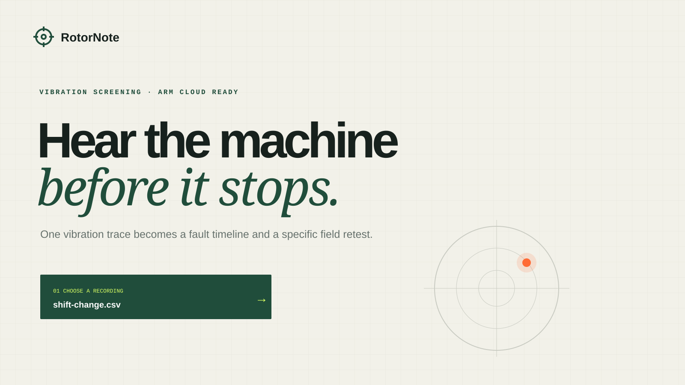

# RotorNote

**Hear the machine before it stops.** RotorNote turns a vibration CSV into a window-by-window machine-health screen and a concrete field retest. It is a self-contained Cloud AI entry for the Arm Create: AI Optimization Challenge.



## The complete loop

1. Drop a one-column `amplitude` CSV (or `timestamp,amplitude`) and set its sample rate.
2. Choose the scalar FP32 baseline or the INT8 WebAssembly SIMD engine.
3. Review the learned condition, confidence, waveform, spectrum, and fault timeline.
4. Follow the condition-specific retest prompt and capture a like-for-like reading.

The bundled **Shift change** recording is the fastest judge path: it starts inside the learned healthy envelope and ends with an imbalance-like pattern. No API key, login, network model download, or external service is required.

## Run locally

Prerequisite: Node.js 22.x and npm.

```bash
npm ci --ignore-scripts --no-audit --no-fund
npm run build
npm test
npm start
```

Open <http://127.0.0.1:8787>, select **Shift change**, and click **Screen recording**. The generated artifacts are committed; `npm run build` deterministically recreates the SIMD kernel, model, samples, and gallery.

Useful commands:

```bash
npm run test:coverage
npm run benchmark -- --output benchmark/results/local-x64.json
npm run validate
npm run secret-scan
```

## Arm optimization

Both paths run the same 48→256→128→5 learned network and the same signal features.

| Path | Weights | Compute |
|---|---:|---|
| Baseline | FP32, 184,340-byte artifact | scalar JavaScript dense loops |
| Optimized | symmetric INT8, 47,252-byte artifact | WebAssembly SIMD `v128` loads and dot products |

The optimized artifact uses 74.37% fewer weight bytes. That is a byte-level artifact fact. Native performance is measured—not presumed—by [the Arm64 workflow](.github/workflows/native-arm64.yml), whose architecture gate requires `aarch64` on `ubuntu-24.04-arm` and uploads raw samples and hashes.

**Evidence status:** local x64 tests and benchmark-harness validation are available in [`receipts/LOCAL-VALIDATION.md`](receipts/LOCAL-VALIDATION.md). Native Arm64 performance remains **PENDING** until a real workflow artifact is linked. x64 timing is never presented as native Arm evidence.

## Model and data

RotorNote uses a supervised extreme-learning network fitted to original, deterministic physics-inspired simulations for five patterns: healthy, imbalance, misalignment, looseness, and bearing-like impacts. Runtime features combine 32 normalized spectral bands, eight time-domain measures, and eight spectral-shape measures across 2,048-sample windows with 50% overlap.

The committed metadata records seed, architecture, calibration scales, artifact hashes, and a held-out simulation result. That held-out result validates pipeline consistency only; it is **not field accuracy**. RotorNote is a screening aid, not a safety controller or diagnosis.

## API

```bash
curl -fsS http://127.0.0.1:8787/health
curl -fsS -X POST \
  -H 'content-type: text/csv' \
  -H 'x-sample-rate: 1024' \
  --data-binary @samples/bearing-pulse.csv \
  'http://127.0.0.1:8787/api/analyze?engine=optimized'
```

Limits: UTF-8 CSV, 2 MiB, 2,048–131,072 samples, 256–5,000 Hz, finite amplitude within ±1,000. Errors are structured JSON with a request ID. Uploads are processed in memory and not retained.

## Deploy

The judge path needs no secrets:

```bash
docker compose up --build
curl -fsS http://127.0.0.1:8787/health
```

The image builds on `node:22-alpine`, runs as the unprivileged `node` user, exposes port 8787, and includes a health check. Set `HOST=0.0.0.0` and `PORT` as required on any Arm cloud VM/container service. Deployment has not been claimed in this repository without a live URL receipt.

## Repository map

- `src/` — CSV boundary, signal features, inference runtime, analysis, HTTP server
- `kernel/` and `dist/` — readable WAT source and generated SIMD WebAssembly
- `model/` — hashed FP32/INT8 artifacts and transparent metadata
- `web/` — responsive, keyboard-usable interface with reduced-motion support
- `tests/` — unit, integration, hostile-input, integrity, dependency-failure, retry/recovery tests
- `benchmark/` — deterministic, alternating-order benchmark with raw samples
- `assets/gallery/` — three original, deterministic 1600×900 SVG gallery assets

Read [ARCHITECTURE.md](ARCHITECTURE.md), [SECURITY.md](SECURITY.md), [BENCHMARKS.md](BENCHMARKS.md), and [SUBMISSION.md](SUBMISSION.md) for the technical and submission details.

MIT licensed. The only npm dependency is the Apache-2.0-licensed `wabt` build tool; production runtime has zero third-party npm dependencies.
